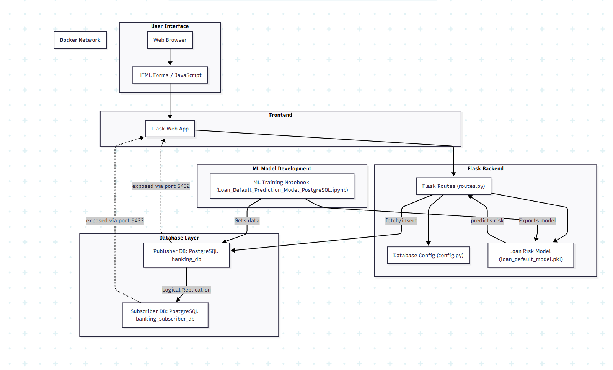
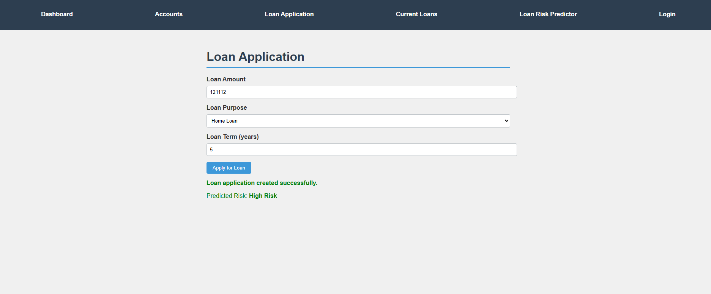
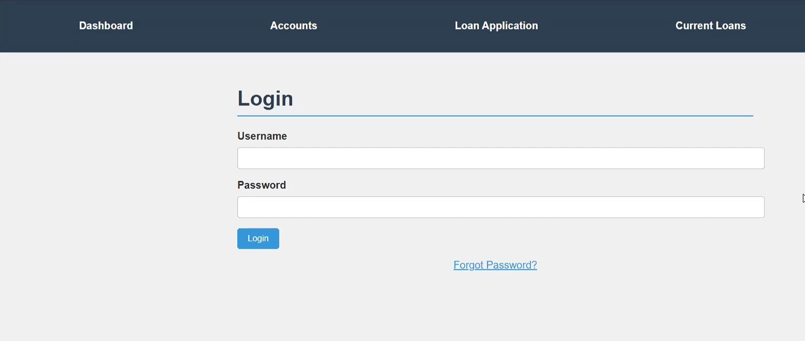
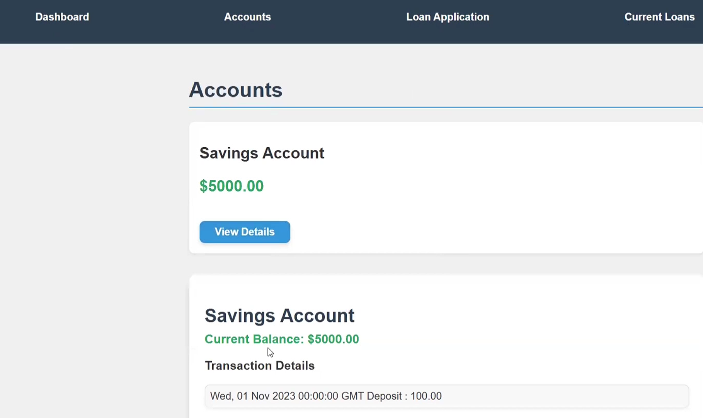

# 🏦 Distributed Banking System

A scalable, high-performance web-based banking application built with **Flask**, **PostgreSQL**, and an integrated **Machine Learning model** to predict loan default risk. The backend utilizes **Dockerized Publisher-Subscriber replication** for fault-tolerance and efficient data processing.

---

## 🚀 Features

* 🔐 Secure User Authentication  
* 💳 Account Overview & Details  
* 💸 Money Transfers Between Accounts  
* 📜 View Transaction History  
* 🏦 Loan Application & Status Tracking  
* 📡 Real-time PostgreSQL Logical Replication  
* 🧠 Loan Default Risk Prediction (ML Model)

---

## 🛠 Tech Stack

| Layer      | Technologies Used                   |
| ---------- | ----------------------------------- |
| Backend    | Python, Flask                       |
| Frontend   | HTML, CSS, JavaScript (Jinja2)      |
| Database   | PostgreSQL (Publisher & Subscriber) |
| ML Modeling| scikit-learn, XGBoost, joblib       |
| Deployment | Docker & Docker Compose             |

This architecture ensures fast response times, data availability, and system resilience while enabling real-time predictions.

---

## 📈 System Workflow Diagram

The diagram below illustrates the complete data and application flow, from user interaction to database replication and machine learning prediction.

---

# 🚀 Project Implementation Guide

This guide provides all the necessary steps to get the Distributed Banking System running, from understanding its core database optimizations to launching the ML-powered web application.

---

## Part 1: Key Database Optimizations

### Step 1: Performance Optimizations (Partitioning & Indexing)

### ✅ Horizontal Partitioning:

| Table Name    | Partition Method | Partition Key    | Purpose                                    |
| ------------- | ---------------- | ---------------- | ------------------------------------------ |
| EMPLOYEE      | LIST             | Branch_BranchID | Separate employee data by branch           |
| NOTIFICATIONS | LIST             | NotificationType | Group notifications by type                |
| FRAUD_ALERTS  | RANGE            | Timestamp        | Efficient time-series partitioning         |
| LOAN_PAYMENT  | LIST             | Loan_LoanID     | Partition by individual loan IDs           |
| CARD          | LIST             | CardType         | Split into Credit vs Debit card partitions |

✅ **Indexing:**

| Table            | Indexed Columns                                      | Speeds Up                     |
| ---------------- | ---------------------------------------------------- | ----------------------------- |
| account          | accountid, accounttype                               | Fast account lookup           |
| person           | email, phonenumber                                   | Quick customer search         |
| transaction      | Account_AccountID, TransactionType, TransactionDate | Transaction history retrieval |
| loanapplications | PersonID, Status                                     | Loan tracking by user/status  |
| loan             | Customer_CustomerID, LoanType, Status               | Efficient loan status checks  |

---

## Part 2: Building Custom PostgreSQL Docker Images (Optional)

### Step 1: Publisher Image

```bash
cd publisher
docker build -t your-docker-username/postgres-publisher:latest .
```
Link to init_publisher file: https://drive.google.com/file/d/1vT0YNgnQnO42UCK1sPLBRqx2Yd1vRZ3n/view?usp=sharing
* Copies `init_publisher.sql` → auto-creates database, tables, replication publication.

### Step 2: Subscriber Image

```bash
cd ../subscriber
docker build -t your-docker-username/postgres-subscriber:latest .
```
Link to init_subscriber file: https://drive.google.com/file/d/1c2jtoUGDUF6Ej-t7nuk1AdnIXp24M4ly/view?usp=sharing
* Copies `init_subscriber.sql` → creates subscription to Publisher.

✅ Optionally, push to Docker Hub:

```bash
docker login
docker push your-docker-username/postgres-publisher:latest
docker push your-docker-username/postgres-subscriber:latest
```

---

## Part 3: Environment and Application Setup

### Step 1: Clone the Repository

```bash
git clone <https://github.com/ShreyShah1018/Distributed-Banking-System>
cd Distributed-Banking-System
```

### Step 2: Set Up Python Virtual Environment

```bash
python -m venv venv
venv\Scripts\activate    # Windows
# source venv/bin/activate  # Mac/Linux
```

### Step 3: Install Dependencies

```bash
pip install -r requirements.txt
```

---

## Part 4: Database Deployment with Docker

### Step 1: Pull Prebuilt Docker Images (Optional)

```bash
docker pull jishnat/custom-postgres
docker pull jishnat/custom-sub-postgres
```

### Step 2: Create Docker Network

```bash
docker network create pg_network
```

### Step 3: Run Publisher Database

```bash
docker run -d --rm --name publisher-db --network pg_network -p 5432:5432 -e POSTGRES_PASSWORD=postgres -e POSTGRES_DB=banking_db jishnat/custom-postgres
```

### Step 4: Run Subscriber Database

```bash
docker run -d --rm --name subscriber-db --network pg_network -p 5433:5432 -e POSTGRES_PASSWORD=postgres -e POSTGRES_DB=banking_subscriber_db jishnat/custom-sub-postgres
```

### Step 5: Verify Containers

```bash
docker ps
```

---

## Part 5: Understanding the Application Code

### Backend (📂 Distributed_Banking_System/)

| File               | Role                                                   |
| ------------------| ------------------------------------------------------ |
| `__init__.py`      | Initializes Flask app and loads routes                 |
| `routes.py`        | Contains all endpoints, connects to database, calls ML|
| `config.py`        | Stores DB connection settings                          |
| `loan_default_model.pkl` | Trained ML model saved using joblib             |

### Frontend (📂 templates/ & static/)

| Folder       | Purpose                                         |
| ------------ | ----------------------------------------------- |
| `templates/` | All HTML pages (login, accounts, loans, ML form)|
| `static/js`  | JavaScript files for dynamic content            |

✅ Dynamic Interaction:

- Clicking **View Transactions** → AJAX call → JSON response → Page updates without reload.
- **Loan Application** now includes **risk prediction** using trained ML model.

---

## Part 6: ML Integration for Loan Risk Prediction

### Step 1: Model Training via Notebook

1. Launch `Loan_Default_Prediction_Model_PostgreSQL.ipynb`
2. Load PostgreSQL data, preprocess features:
   - log_requestedamount
   - log_loanamount
   - loan_to_request_ratio
   - is_high_interest
3. Train 5 models (Random Forest, XGBoost, KNN, Naive Bayes, Decision Tree)
4. Select best model based on accuracy, F1-score
5. Save final model:
```python
joblib.dump(best_model, 'loan_default_model.pkl')
```

### Step 2: Flask Integration

- `routes.py` loads the `.pkl` model
- `/loan_predict` and `/loan_application` both use `model.predict()` to classify
- Prediction displayed on frontend using `result.html` or inline form response

---

## Part 7: Application Launch

### Step 1: Configure Database in `config.py`

```python
DB_HOST = 'localhost'
DB_PORT = '5432'
DB_NAME = 'banking_db'
DB_USER = 'postgres'
DB_PASSWORD = 'postgres'
```

### Step 2: Run Flask App

```bash
python -m Distributed_Banking_System
```

Or directly run `__init__.py` in your IDE.

### Step 3: Access the App

[http://127.0.0.1:5000](http://127.0.0.1:5000)
Application Showcase
Login Page

Accounts Overview	



✅ All data created (accounts, loans, predictions) is written to the **Publisher** and automatically replicated to the **Subscriber**.

---

# 🌐 Key URLs

| Page             | URL Path             |
| ---------------- | -------------------- |
| Login            | `/login`             |
| Dashboard        | `/home`              |
| Accounts         | `/accounts`          |
| Transactions     | `/transactions`      |
| Make Transaction | `/make_transactions` |
| Loan Application | `/loan_application`  |
| View Loans       | `/loans`             |
| ML Predictor     | `/loan_predict`      |
| Logout           | `/logout`            |

---

## 💡 Why This Matters

* Docker ensures a **portable**, **scalable**, and **fault-tolerant** deployment.  
* Partitioning and indexing guarantee **fast data access** even as the database grows.  
* Logical replication offers **high availability** without expensive infrastructure.  
* ML integration brings **data-driven intelligence** to loan processing workflows.  

---
